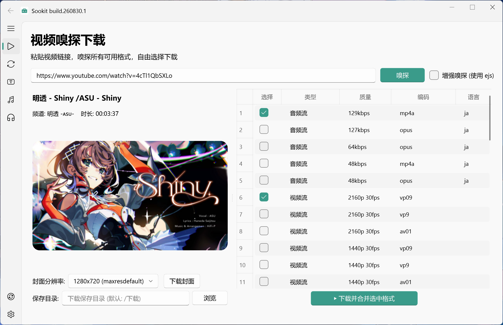

# Sookit

一个 Windows 桌面音视频工具箱

基于 PyQt6 和 [PyQt-Fluent-Widgets](https://github.com/zhiyiYo/PyQt-Fluent-Widgets) 构建

自用，可能会有很多 bug

~~（vibe coding 写出来的玩具罢了）~~

---

## ✨ 功能

- **视频嗅探** — 粘贴链接嗅探视频，格式/画质选择、封面选择下载，支持视频与音频下载
- **直播监控** — 监控直播状态
- **字幕烧录** — 将字幕烧录进视频
- **音频提取** — 从视频中提取音轨
- **音频覆盖** — 替换视频音轨
- **任务队列** — 下载任务统一管理与进度显示，支持暂停/续传/取消

## 🚀 安装与运行

### 方式一：安装版（推荐给普通用户）

下载 GitHub Release 中的 `Sookit-Setup-*.exe`，双击安装

### 方式二：源码运行

```bash
git clone https://github.com/sodaa-l/Sookit.git
cd Sookit
uv sync          # 安装依赖
uv run sookit    # 启动
```

首次启动后到「设置」页一键下载 yt-dlp / deno（系统 PATH 里已装 yt-dlp 则优先使用）。

ffmpeg / aria2c 不随仓库分发，建议自行下载放到对应目录（**ffmpeg 缺失时会尝试使用系统 PATH 的版本**；aria2c 缺失仅降级为默认下载器，不影响功能）：

- `tools\ffmpeg\`（ffmpeg.exe、ffprobe.exe）
- `tools\aria2c\`（aria2c.exe）

## 🖥️ 界面预览



## 📦 数据与资源位置

| 数据              | 位置                                                   |
| --------------- | ---------------------------------------------------- |
| 用户配置 / 任务记录     | `%APPDATA%\Sookit`（config.json、completed_tasks.json） |
| 视频封面缓存          | `%LOCALAPPDATA%\Sookit\covers`                       |
| 运行日志            | `%LOCALAPPDATA%\Sookit\log\sookit.log`               |
| yt-dlp / deno   | 程序目录 `tools\yt-dlp`（若系统 PATH 有安装则优先读取）               |
| ffmpeg / aria2c | 程序目录 `tools\`（安装版内置）                                 |

## 📄 许可

本项目基于 **GPL v3** 开源（见 [LICENSE](LICENSE)）
