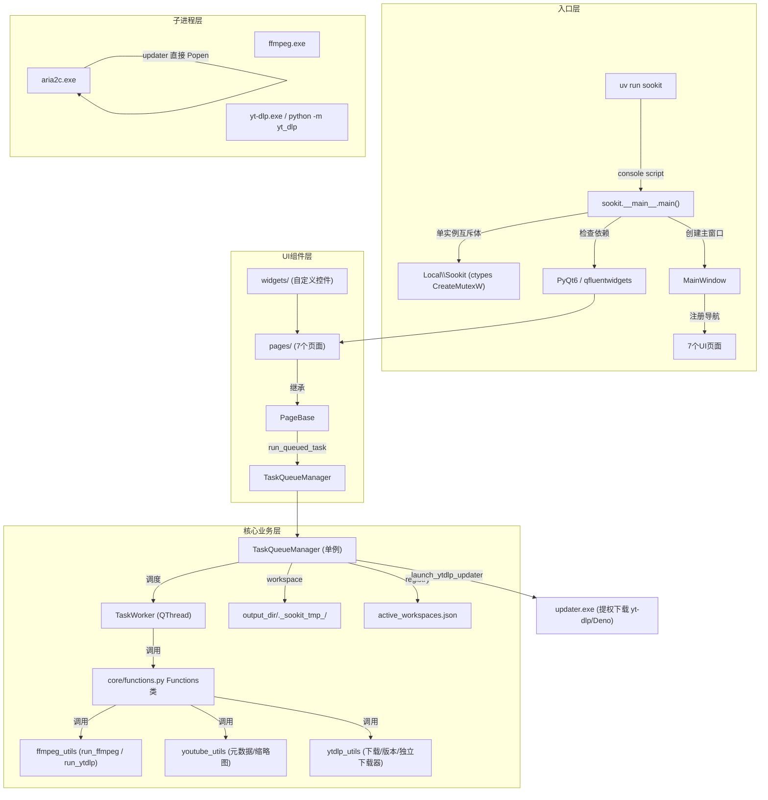

# Sookit 开发文档

面向开发者与 AI 编码助手的快速上手指南，包含架构、模块速查、设计决策与已知坑位。公开使用说明见 [README](../README.md)。

> 本文件会随代码演进持续维护。改动代码后若涉及架构/设计决策/参数签名，请同步更新此处。

## 架构总览

```
src/sookit/        代码包 (标准 src 布局)
    │
    ├─ __main__.py        程序入口 (main() — 单实例互斥体 + 依赖检查 + 启动)
    ├─ main_window.py     MainWindow 主窗口 (FluentWindow) + quit_app 清理 + 关闭确认
    ├─ updater.py         独立 GUI 下载器入口 (打包为 updater.exe，提权下载 yt-dlp/Deno)
    ├─ paths.py           统一资源路径定位 (PROJECT_ROOT / APPDATA / LOCALAPPDATA)
    │
    ├─ assets/            静态资源 (960x960.png 应用图标)
    │
    ├─ pages/          UI 页面层 (7 个页面)
    │   └─ base.py     PageBase 基类 — 拖放、run_queued_task、自动关机
    │
    ├─ core/           业务逻辑层
    │   ├─ functions.py     Functions 类 — 聚合所有功能接口 + 模块再导出
    │   ├─ task_queue.py    TaskQueueManager (单例) — 任务调度 + workspace + registry
    │   ├─ workers.py       QThread 工作线程 (Worker / TaskWorker / MonitorWorker)
    │   ├─ ffmpeg_utils.py  FFmpeg/yt-dlp/aria2c 路径查找和子进程管理
    │   ├─ ytdlp_utils.py   yt-dlp/Deno 集中管理：版本检查、下载、独立下载器调起
    │   ├─ updater.py       Sookit 自身自动更新 (core/updater.py)
    │   ├─ youtube_utils.py YouTube 元数据提取 (HTTP 降级方案)
    │   ├─ config.py        配置管理 (JSON 缓存 + 线程锁)
    │   └─ utils.py         滚动条样式等杂项
    │
    └─ widgets/        可复用 UI 组件层
        ├─ cover_image.py   封面自绘控件
        └─ task_card.py     任务卡片 (2 种类型 + 工厂函数 + 封面三级加载)

运行时数据 (不在项目根，见 paths.py)：
    %APPDATA%\Sookit\           config.json、completed_tasks.json、active_workspaces.json、updates/
    %LOCALAPPDATA%\Sookit\      covers/ (封面缓存)、log/ (sookit.log)
    (均有 VIDEOTOOLBOX_* 环境变量覆盖)
tools/                内嵌二进制 (ffmpeg、aria2c；打包态=程序目录，源码态=项目根)
```



## 目录与模块速查

### 核心模块 (`core/`)

| 文件 | 职责 | 关键导出 |
| --- | --- | --- |
| `functions.py` | 功能中枢。聚合所有子模块并再导出保持向后兼容 | `Functions` (类, 所有 func 均为 @staticmethod) |
| `ffmpeg_utils.py` | FFmpeg 路径、子进程执行 (`run_ffmpeg`/`run_ytdlp`)、时长/大小格式化 | `run_ffmpeg()`, `run_ytdlp()`, `check_ffmpeg()`, `extract_video_frame()` |
| `ytdlp_utils.py` | yt-dlp/Deno 版本检查、下载 (aria2c+urllib 双通道)、独立下载器调起 | `download_ytdlp()`, `download_deno()`, `get_*_version()`, `check_ytdlp_deno_update_needed()`, `launch_ytdlp_updater()` |
| `updater.py` | **Sookit 自身自动更新** (core/updater.py，注意与顶层 updater.py 区分) | `check_latest_version()`, `download_installer()`, `is_newer()` |
| `youtube_utils.py` | YouTube ID 提取、缩略图 URL 构建、HTTP 元数据获取 | `extract_youtube_id()`, `build_thumbnails()`, `fetch_youtube_metadata()` |
| `task_queue.py` | 任务队列单例。进度、workspace 生命周期、active_workspaces registry、JSON 持久化 | `TaskQueueManager`, `Task`, `TaskStatus`, `TaskType`, `_generate_ulid()` |
| `workers.py` | 后台线程: Worker(通用) / TaskWorker(队列, 含 workspace/进程树清理) / MonitorWorker(直播轮询) | `TaskWorker`, `MonitorWorker`, `_kill_process_tree()` |
| `config.py` | JSON 配置文件读写 + 缓存 + 线程锁。主题色、开机自启、下载配置 | `load_config()`, `save_config()`, `load_download_config()` |
| `utils.py` | 滚动条样式、SSL 上下文 | `get_scrollbar_style()`, `get_certifi_ssl_context()` |

### 入口与下载器

| 文件 | 角色 |
| --- | --- |
| `__main__.py` | Sookit 主程序入口。`--silent` 静默启动；`_acquire_single_instance()` 单实例互斥体 (Local\Sookit) |
| `updater.py` (顶层) | 独立下载器 GUI，打包为 `updater.exe`。Sookit 用 `launch_ytdlp_updater` 提权调起，结果文件通信 |
| `sookit/core/updater.py` | Sookit 自身版本检查 + 安装器下载 (与顶层 updater.py 是不同模块) |

### 功能类 `Functions` 方法速查

所有方法均为 `@staticmethod`，**最后一个参数固定为 `log=None`**。下载类方法额外接受 `on_process_created`/`workspace`。

| 方法 | 功能类型 | 依赖 |
| --- | --- | --- |
| `burn_subtitles(video, subtitle, output, encoder, log, on_process_created)` | 字幕烧录 | ffmpeg + libass |
| `replace_audio(...)` | 音频覆盖 | ffmpeg |
| `extract_audio(...)` | 音频提取 | ffmpeg |
| `sniff_youtube(url, log)` | 视频格式嗅探（通用，yt-dlp 支持的站点均可） | yt-dlp |
| `download_youtube(url, format_spec, output_dir, remote, ..., workspace=None)` | 视频下载（通用） | yt-dlp (可选 aria2c) |
| `check_live_status(url, log)` | 直播状态检测 | yt-dlp (降级 HTTP) |
| `sniff_channel(url, log)` | 频道视频列表 | yt-dlp |

> 注：`merge_image_audio` / `batch_merge_image_audio` / `m3u8_to_aac` / `download_xspace` 已随 M3U8 下载、X Space 下载、图片+音频合并三个功能移除（2026-08）。

### 页面 (`pages/`)

所有页面继承 `PageBase(QWidget)`，通过 `run_queued_task()` 加入任务队列。7 个页面：视频嗅探（youtube_page，文案已通用化但类名保留 YouTubePage）、直播监控、字幕烧录、音频覆盖、音频提取、任务队列、设置。

### 自定义组件 (`widgets/`)

同上文架构总览（未变化）。

## 关键设计决策

### 1. 字幕烧录：Windows 驱动器冒号问题

**现象**: FFmpeg subtitles 滤镜将 `E:/path/sub.ass` 中的 `E:` 误解析为选项名。

**最终方案**: `os.chdir()` 到字幕所在目录，filtergraph 只用文件名。

**代价**: 影响全局 cwd，`finally` 块保证恢复。

### 2. 统一任务队列单例

- `TaskQueueManager(QObject)` 单例，并发数控制 (默认 3)、暂停/恢复/取消、进度、日志。
- 已完成任务持久化到 `%APPDATA%\Sookit\completed_tasks.json`，JSON 损坏自动备份 `.bak`。
- 取消任务用 `_cancelling_workers` 保留 QThread 引用直到 `finished`，防 "QThread: Destroyed while thread is still running"。

### 3. filter_script 策略

复杂滤镜图写入临时 `.ff` 文件，通过 `-filter_script:v` 读取。

### 4. 配置缓存锁

`_config_cache` + `threading.Lock()`，惰性加载。

### 5. 暂停/恢复使用 Windows 原生 API

`NtSuspendProcess` / `NtResumeProcess` (ntdll.dll) 挂起/恢复子进程（Python 无 posix signal）。

### 6. yt-dlp 异常退出码宽容处理

退出码非零时，若输出文件存在且 >0 则视为成功。

### 7. 封面三级加载策略 (FfmpegTaskCard)

cover_data (内存) → cover_cache (磁盘) → input_img / input_video (异步截帧) → fallback 图标。

### 8. 每个 yt-dlp 任务独立 workspace（重要）

仅 yt-dlp/aria2c 下载任务使用独立临时工作目录：

```
用户目标目录/
└── ._sookit_tmp_<ULID>/     # 所有 .part/.aria2/.ytdl/.f<ID> 临时文件都在这里
```

- ULID 用 `_generate_ulid()`（26 字符 Crockford base32，与标题无关）。
- **生命周期由 Task 管理**（`task.workspace`），Worker 只使用 `task.workspace`。
- 下载完成 → `_finalize_workspace` 移动 `output_files` 到用户目录（同卷原子 rename），全部成功才删 workspace。
- 取消/关闭/失败 → 删整个 workspace（放弃续传）；**暂停保留**。
- 启动时用 `active_workspaces.json` registry 清理异常退出残留（只清自己登记的，不全盘扫描）。
- **创建顺序保证**：先生成路径 → `_register_workspace`（原子保存）→ `os.makedirs`，宁多记不漏清。

### 9. 进程树终止：taskkill /T /F

Sookit 下载任务用 `taskkill /PID <launcher> /T /F` 递归终止整个进程树（yt-dlp launcher → real yt-dlp → aria2c）。

- **不按进程名全局杀**，只针对本任务 PID 树，避免误伤其他任务/updater。
- `_kill_process_tree(pid)` 封装（workers.py），taskkill 失败/进程已退静默。
- **不用 Job Object**：实测孙进程不继承 Job、无法事后 Assign（err=5），故用 taskkill。

### 10. updater.exe 独立下载器

yt-dlp/Deno 下载更新从 Sookit 解耦为独立 `updater.exe`：

- Sookit 只查版本（`check_ytdlp_deno_update_needed`），需更新才 `launch_ytdlp_updater` 提权调起。
- 通信：Sookit 生成 result_path → runas 启动 `updater.exe --ytdlp-updater-gui <result_path>` → updater 写结果 JSON → Sookit 轮询（终止条件：**结果文件出现或 updater.exe 进程消失**；进程消失 + 无结果 = 下载器崩溃/被强杀，立即判失败；结果文件读取后删除，避免累积 `.ytdlp_updater_result_*.json`，坏 JSON 同样清理）。
- aria2c 设置自动跟随（复用 `download_ytdlp`/`download_deno`）。
- **updater 取消的 QThread 竞态崩溃（2026-08 修复）**：`done.emit` 同时触发 `_on_done`/`thread.quit`/`finished→deleteLater`，与 `_poll_cancel`（QTimer 100ms）存在生命周期竞态——QThread C++ 对象被删后访问 `isRunning()` 抛 RuntimeError，主线程 QTimer 回调未捕获异常 → updater 静默崩溃（无结果文件、Sookit 超时）。修复：不连接 `deleteLater`（QThread 随对话框销毁回收）+ `_thread_alive()` 防御（RuntimeError 按线程已结束处理）。
- updater 取消/关闭（2026-08 重构为非阻塞）：
  - `_download_file_with_aria2c` 用 reader 线程 + `queue.get(timeout=0.2)` 非阻塞读 stdout，取消不被 read 阻塞；
  - `_on_cancel` **不阻塞 GUI 线程**：设标志 + 显示"正在取消"后立即返回，`QTimer` 每 100ms 轮询线程状态（`_poll_cancel`）；
  - 超时兜底（20s）：先 `force_terminate()` 杀 aria2c 进程树 → `wait(5000)` → **done 信号的真实结果优先**于硬编码 cancelled（解决"取消瞬间下载恰好完成、文件已被替换"竞态）→ 确实卡死才写 cancelled 关窗；
  - `closeEvent` 未完成时 `ignore()` + `hide()`，后台写完结果文件再退出（Sookit 不会空等超时）；
  - 取消确认后直接关窗，不显示"已取消"文字（停留时间太短无可读性）。
- `_DownloadWorker` 通过 `on_proc=self.set_proc` 记录当前 aria2c Popen；`force_terminate` 先 terminate，仍存活则 `taskkill /PID <specific_pid> /T /F`（不按进程名全局杀）。

### 11. 版本检查走 releases 重定向

`get_ytdlp_latest_version()`/`get_deno_latest_version()` 用 `_version_from_latest_url`：
- 从 GitHub `releases/latest` 的 **302 重定向 Location** 解析版本，绕开 `api.github.com` 匿名限流（403）。
- 只读重定向、**不下载 body**（`_VersionResolved` 异常中断）。
- 兼容 `/releases/download/<v>/<file>` 与 `/releases/tag/<v>` 两种路径。

### 12. 单实例互斥体 + 安装/卸载检测

- `__main__.py` 创建 `Local\Sookit` 互斥体，重复启动提示并退出。
- `installer.iss` 的 `AppMutex=Local\Sookit`，安装/卸载时弹窗询问（不自动关闭）。

### 13. 关闭 Sookit 确认

`closeEvent` 有 RUNNING 任务时弹 `qfw.Dialog`「关闭 Sookit 会停止正在进行的任务，是否关闭？」（yesButton「关闭」/cancelButton「取消」），确认后 `quit_app` → `cancel_all()`（默认 `delete_part=True`，终止进程树 + 删各任务 workspace）。

### 14. 导航栏展开宽度

`MainWindow.__init__` 中 `self.navigationInterface.panel.setExpandWidth(250)`（qfluentwidgets 默认 322px 偏宽）。该 API 会同步更新 `NavigationWidget.EXPAND_WIDTH`（条目宽度）；折叠态固定 48px 不可调；`setMinimumExpandWidth`（默认 1008px）控制窗口多宽时面板自动保持展开。

### 15. 功能裁剪记录（2026-08）

移除 M3U8 下载、X Space 下载、图片+音频合并三个功能（页面 + Functions 方法 + `TaskType.M3U8` + `M3U8TaskCard`）。理由：均可被 yt-dlp 链路替代（X Space 页纯为 yt-dlp flag 包装；M3U8 裸 ffmpeg 无重试/续传/Headers）。旧 `completed_tasks.json` 中 `task_type="m3u8"` 记录在 `_load_completed_tasks` 的 try/except 中被安全跳过。未来若需"仅音频下载"，给 `download_youtube` 加可选 `-x --audio-format` 后处理即可覆盖。

### 16. yt-dlp 更新检查与取消的完善（2026-08）

- **检查态/下载态分离**：`_update_ytdlp(skip_check=False)`——已安装（tools）先「检查中」查新版本，确需更新才切「更新中」提权下载；未安装直接「安装中」；自动更新确认路径 `skip_check=True` 直达「更新中」。
- **取消中性化**：用户主动取消不算失败——`_comp_state` 对 `cancelled` 显示「已取消」，全取消走中性 info「已取消」提示（非红色错误条）；`any_failed` 判定排除 cancelled（混合场景取消组件显示「已取消」、真失败仍走错误条）。
- **数据源统一**：自动检查（进设置页触发，每次启动一次）从 PyPI JSON API 改为 `get_ytdlp_latest_version()`（GitHub releases 重定向，与手动检查/更新同源，消除两源发布时序差的矛盾）。
- **「有新版本」Dialog → 常驻 InfoBar**：非阻塞 warning 条（含「前往设置」按钮，与「依赖缺失」条形式一致），引用 `_yt_new_version_bar` 防重复堆积，更新成功后 `close_yt_new_version_bar()` 自动关闭。
- **`launch_ytdlp_updater` 轮询重写**：终止条件从固定 300s 改为「结果文件出现或 updater.exe 进程消失」（`tasklist` 检测，普通权限可见提权进程；输出 GBK 用 `errors="ignore"` 解码）——慢网络下载不误报失败、强杀/崩溃立即判失败（"下载器已退出但未返回结果"）；`timeout` 语义改为防挂死绝对上限（默认 30 分钟）。
- **坏 JSON/`.aria2` 残留修复**：`json.loads` 失败分支补 unlink（此前只修了读取成功分支）；`_download_file` 取消/失败清理补删 `.aria2` 控制文件（此前只删 `.part`）。

## AI 编码约定

### 环境

```bash
# 所有 Python 命令必须通过 uv run 执行
uv run python script.py
```

Windows 中文环境 GBK 代码页：Python 文件 I/O 显式 `encoding="utf-8"`，必要时 `PYTHONUTF8=1`。

### 页面开发模式

```python
class MyNewPage(PageBase):
    def __init__(self, parent=None):
        super().__init__(parent)
        self._drop_target = qfw.LineEdit()  # 注册拖放目标

    def _start_action(self):
        # 加入任务队列 (不要直接创建 Worker)
        self.run_queued_task(
            func=Functions.some_method,
            args=(arg1, arg2, arg3, 'software'),  # 最后一个参数留给 log
            task_type=TaskType.FFMPEG,
            title=f"操作 - {filename}",
            metadata={'filename': filename, 'input_video': video_path, 'out': output_path}
        )
```

### Functions 方法规范

- 所有耗时操作为 `@staticmethod`，最后一个参数 `log=None`。
- 通过 `run_ffmpeg(cmd, log, None, on_process_created)` 或 `run_ytdlp(cmd, log, process_ref, on_process_created, on_path)` 执行子进程。
- **不要直接调用 `subprocess.Popen`**（用 run_ffmpeg/run_ytdlp 统一管理）。
- 下载类方法接受 `workspace` 参数（非 None 时 `-o` 指向 workspace）。

### 子进程参数约定（重要）

- `run_ffmpeg(cmd, log, process_ref=None, on_process_created=None)`：ffmpeg 进程经 `on_process_created` 暴露，供 TaskWorker 取消时 taskkill。
- `run_ytdlp(cmd, log, process_ref=None, on_process_created=None, on_path=None)`：
  - 内部加 `--encoding utf-8`（强制 yt-dlp 输出 UTF-8，避免中文路径乱码）和 `--print-to-file after_move:filepath`。
  - **返回值是列表**：按行收集多个最终输出路径（支持 `-f '137,140'` 多文件）。
  - 签名保留 `on_path`，但 `download_youtube` 当前**不传** on_path（output_files 靠 `--print-to-file` 返回列表）。
- `ytdlp_utils._download_file_with_aria2c` 用**reader 线程 + queue.get(timeout=0.2)** 非阻塞读 stdout（取消不被 read 阻塞），`on_proc(proc)` 暴露 aria2c。

### 下载取消检查点（重要）

所有可取消的下载流程（`download_ytdlp`/`download_deno`/`_download_file`）通过 `_raise_if_cancelled(cancel_cb)` 在**各阶段之间**插入检查点：

- 函数入口、本地版本查询后、最新版查询后、启动下载进程前各一个；
- 消除"版本检查阶段"的取消盲区（网络超时 20s + `--version` 子进程 20s，两个组件最坏 ~60s 内取消无响应）；
- `_download_file` 入口检查点保证取消后**不会启动新的 aria2c/urllib 进程**；
- `_version_from_latest_url` 超时 20s（国内直连 GitHub TLS 握手偶发超 10s，过短会误判"已最新"静默跳过更新）。

### metadata 结构约定

| 字段 | 用途 | 必填 |
| --- | --- | --- |
| `filename` | 任务显示名称 | 是 |
| `input_video` / `input_img` | FfmpegTaskCard 封面加载 | 推荐 |
| `out` | CompletedThumbnailCard 打开文件/文件夹 | 推荐 |
| `cover_data` (bytes) | 封面二进制数据 | 可选 |

### 线程安全

- **不要**直接访问 `TaskQueueManager` 的 `active_tasks` / `completed_tasks` 内部 dict — 使用 `get_active_tasks()` / `get_completed_tasks()`。
- **不要**跨线程操作 Qt 控件 — 使用 `pyqtSignal`。

### InfoBar 提示规范（重要）

- **新增 InfoBar 提示一律使用 `show_infobar()`**（`sookit/widgets/infobar.py`），**不要直接调用 `qfw.InfoBar.*`**：

  ```python
  from sookit.widgets.infobar import show_infobar
  show_infobar(self, "error", title="检查更新失败", content=..., duration=-1)
  ```

- 函数按 content **实际渲染宽度**自动分级：≤560px 保持原生单行（Horizontal）；超过则重建为竖排（Vertical）+ **标点优先贪心换行**（`，。；：！？、` 后为首选断点，无标点长段二分硬断）+ label 固定宽度与精确高度。阈值常量 `WRAP_THRESHOLD = 560`，可用 `wrap_max_width` 参数覆盖。
- 需要挂自定义控件（按钮等）时用返回值：`bar = show_infobar(...); bar.addWidget(btn)`。
- 背景（三个坑，终版方案逐一解决）：
  1. qfluentwidgets 内置换行按"父窗口宽/9"的**字符数**（上限 120）硬换行，而中文字符显示宽度约为 ASCII 两倍——长中文文案实际不换行、单行撑爆 InfoBar（实测比 1131px 窗口还宽）；
  2. wordWrap QLabel 的 sizeHint 高度仍按单行算，且布局会**垂直压缩 label**（行距挤压、文本截断）——**高度必须在 label 层解决**：`fontMetrics.boundingRect(0, 0, 宽, 10000, TextWordWrap, text)` 精确计算后 `label.setMinimumHeight()`，bar 层的 setMinimumHeight 补偿治标不治本（bar 高了 label 仍被压）；
  3. 换行后需同步 `bar.content = wrapped`：窗口 resize 时库的 `_adjustText` 会用 TextWrap 重排 `self.content`，其对含 `\n` 文本逐行处理不破坏已有换行（已从源码确认 + resize 实测）。
- 初始宽度可能偏大（QSS 字体 polish 前的 sizeHint 偏大，实测 679 → 557），封装内已加事件循环后二次 `adjustSize` 收缩。

### 导入规范

```python
from sookit.core.functions import Functions, check_ffmpeg, run_ffmpeg
from sookit.core.task_queue import TaskType, TaskQueueManager
from sookit.pages.base import PageBase
```

### 新增代码时注意

- **给 subprocess 命令插参数**：必须插在可执行路径 `cmd[0]` **之后**（`cmd_list[:1] + [...] + cmd_list[1:]`），否则 Popen 把参数当程序名。
- **修改 Task/Workspace**：新增下载任务时确认 Task 有 `output_dir`/`workspace`/`output_files`，workspace 由 TaskQueueManager 管理，Worker 不拥有。
- **版本号**：升版三处同步（`__init__.py` APP_VERSION、`pyproject.toml` version、`installer.iss` MyAppVersion），详见[打包与发布](#打包与发布)。

## 打包与发布

### 版本号规范

格式 `YYMMDD.N`（如 `260827.1`）：日期 + 当天递增序号（当天首个版本 N=1）。升版时**三处同步**：

| 文件 | 字段 | 示例 |
| --- | --- | --- |
| `src/sookit/__init__.py` | `APP_VERSION`（带 `build.` 前缀） | `"build.260827.1"` |
| `pyproject.toml` | `[project] version` | `"260827.1"` |
| `packaging/installer.iss` | `#define MyAppVersion` | `"260827.1"` |

### 打包流程

```bash
# 1. PyInstaller onedir 构建（Sookit.exe 与 updater.exe 共享同一 _internal，避免体积翻倍）
uv run pyinstaller --noconfirm packaging/sookit.spec

# 2. 复制外部工具到产物目录（排除 yt-dlp/ —— yt-dlp/Deno 不随安装包分发，
#    装后首次点「下载/更新」由 updater.exe 提权下载到程序目录 tools/yt-dlp）
mkdir -p dist/Sookit/tools && cp -r tools/aria2c tools/ffmpeg dist/Sookit/tools/

# 3. Inno Setup 编译安装包（scoop 安装的 ISCC 经 shims 调用）
/d/scoop/shims/ISCC.exe packaging/installer.iss
```

产物：`dist/Sookit-Setup-<版本>.exe`（安装包）；`dist/Sookit/`（onedir 目录，可先直接运行验证再编译安装器）。

### 安装器行为要点（installer.iss）

- 仅简体中文界面（`ChineseSimplified.isl` 已入库，来自官方 issrc 仓库 `Files/Languages/`）。
- 默认安装到 `{autopf}\Sookit`；**父路径可自选，末级目录强制为 Sookit**：`[Code] NextButtonClick(wpSelectDir)` 检测所选目录最后一级非 Sookit 时自动追加 `\Sookit`（如 `D:\Apps` → `D:\Apps\Sookit`，盘符根 `D:\` → `D:\Sookit`；不区分大小写、不会重复追加）。限制：静默安装 `/VERYSILENT /DIR=` 不显示向导页，不走该回调，无法校验。
- `AppMutex=Local\Sookit`：安装/卸载时检测 Sookit 是否在运行，弹窗询问（不自动关闭）。
- 卸载删除整个 `{app}`（含 updater 运行时产物 `tools\yt-dlp`）及 `%APPDATA%\Sookit`、`%LOCALAPPDATA%\Sookit` 用户数据。
- ISCC 编译时的 `PrivilegesRequired=admin + per-user areas` 警告为已知行为：多账户场景下若用另一管理员凭据提权，`{userappdata}`/`{localappdata}` 会解析到提权账户而非实际使用者（仅数据残留，不影响功能）；单管理员场景无影响，维持现状不加 `UsedUserAreasWarning=no` 压制。

## 已知踩坑备忘录

| 问题 | 根因 | 解决方案 |
| --- | --- | --- |
| `E:` 被 subtitles 滤镜当选项名 | Windows 驱动冒号被选项解析器拆分 | `os.chdir` + 相对路径文件名 |
| QThread 被 GC 导致崩溃 | 取消 worker 后 QThread 对象被回收 | `_cancelling_workers` 保留引用 |
| 暂停/恢复无效 | Windows 无 posix signal | `NtSuspendProcess` 原生 API |
| yt-dlp 退出码非零但下载成功 | ffmpeg 合并阶段报错 | 检查文件存在即视为成功 |
| JSON 损坏丢失历史 | 写文件过程中断 | 自动备份 `.bak` |
| yt-dlp 中文路径乱码 | Windows GBK 输出, 按 UTF-8 解码 | `run_ytdlp` 加 `--encoding utf-8` |
| `--encoding` 插错位置 | 插在 cmd[0] 之前被当程序名 | `cmd_list[:1] + ['--encoding','utf-8'] + cmd_list[1:]` |
| `.part` 删不掉 | 取消删精确路径不覆盖 `.part-FragN`/`.ytdl` 命名 | workspace 方案，删整个目录 |
| aria2c 取消后残留 | `proc.stdout.read` 阻塞，取消检查无法及时 kill | reader 线程 + queue.get(timeout) + force_terminate 兜底 |
| aria2c 403 (YouTube) | IP/节点被限流，非代码问题 | 换节点；非反爬规避 |
| 多任务写同一 `.part` 冲突 | 同一 url+out_dir 两个任务 | `_find_duplicate` 防重复 |
| 安装/卸载时文件占用删不掉 | 卸载时程序运行 | 单实例互斥体 + AppMutex |
| 卸载删不掉 tools\yt-dlp | updater 运行时产物不在卸载记录 | `[UninstallDelete]` 删整个 `{app}` |
| 异常退出残留 workspace | 进程被杀中断下载，临时目录未清理 | active_workspaces registry 启动清理 |
| updater 取消时静默崩溃无结果 | done/finished→deleteLater 与 QTimer 回调竞态，访问已删 QThread 抛 RuntimeError | 不连 deleteLater + `_thread_alive()` 防御（RuntimeError 按线程已结束处理） |
| InfoBar 换行文本行距压缩/截断 | wordWrap QLabel sizeHint 高度按单行算，布局垂直压缩 label | label 层精确高度（fontMetrics boundingRect）+ setFixedWidth 钉死宽度 |
| 重打包后 updater 回退 urllib | 打包只跑 pyinstaller 漏了复制 tools，aria2c 缺失 | 打包两步：pyinstaller + 复制 tools/aria2c ffmpeg |
| UAC 提权进程不继承环境变量 | runas 启动重建环境块 | 测试时 Sookit 侧迁就 updater 的 frozen 路径解析（VIDEOTOOLBOX_TOOLS_DIR 指向其 tools） |
| 长中文文案撑爆 InfoBar | 库内置换行按字符数（上限 120）算，中文显示宽度≈ASCII 两倍 | 统一走 `show_infobar()`，按渲染宽度自动换行 |
