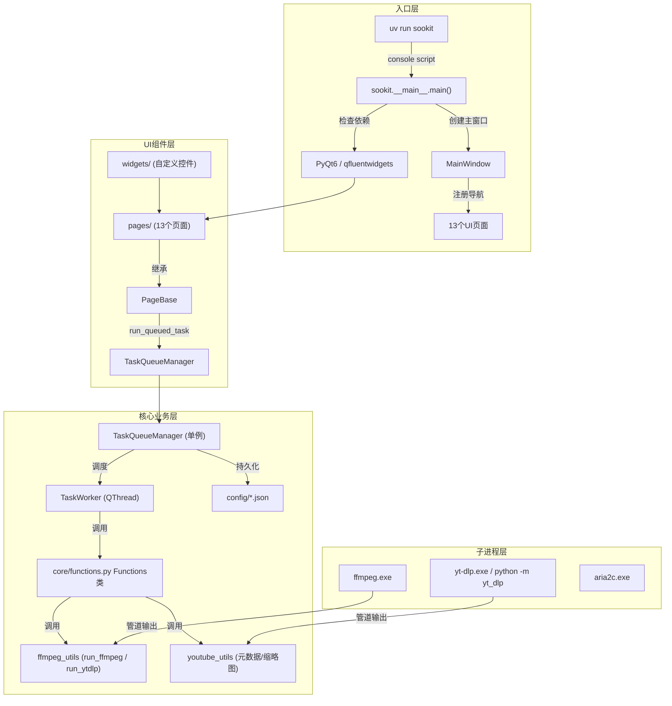

# Sookit 开发文档

面向开发者与 AI 编码助手的快速上手指南，包含架构、模块速查、设计决策与已知坑位。公开使用说明见 [README](../README.md)。

## 架构总览

```
src/sookit/        代码包 (标准 src 布局)
    │
    ├─ __main__.py        程序入口 (main() — 依赖检查 + 启动逻辑)
    ├─ main_window.py     MainWindow 主窗口 (FluentWindow)
    ├─ paths.py           统一资源路径定位 (PROJECT_ROOT + 包内 assets)
    │
    ├─ assets/            静态资源 (960x960.png 应用图标)
    │
    ├─ pages/          UI 页面层 (13 个页面)
    │   └─ base.py     PageBase 基类 — 拖放、run_queued_task、自动关机
    │
    ├─ core/           业务逻辑层
    │   ├─ functions.py     Functions 类 — 聚合所有功能接口 + 模块再导出
    │   ├─ task_queue.py    TaskQueueManager (单例) — 任务调度 + 进度 + 持久化
    │   ├─ workers.py       QThread 工作线程 (Worker / TaskWorker / MonitorWorker)
    │   ├─ ffmpeg_utils.py  FFmpeg/yt-dlp/aria2c 路径查找和子进程管理
    │   ├─ youtube_utils.py YouTube 元数据提取 (HTTP 降级方案)
    │   ├─ config.py        配置管理 (JSON 缓存 + 线程锁)
    │   └─ utils.py         滚动条样式等杂项
    │
    └─ widgets/        可复用 UI 组件层
        ├─ cover_image.py   封面自绘控件
        └─ task_card.py     任务卡片 (3 种类型 + 工厂函数 + 封面三级加载)

config/              运行时数据 (项目根目录)
    ├─ config.json          用户配置 + 主题色
    ├─ covers/              封面缓存
    └─ completed_tasks.json 已完成任务持久化
tools/               内嵌二进制 (ffmpeg、aria2c 等)
```



## 目录与模块速查

### 核心模块 (`core/`)

| 文件 | 职责 | 关键导出 |
| --- | --- | --- |
| `functions.py` | 功能中枢。聚合所有子模块并再导出保持向后兼容 | `Functions` (类, 所有 func 均为 @staticmethod) |
| `ffmpeg_utils.py` | FFmpeg 路径 (内嵌优先, 回退 PATH)、子进程执行、时长/大小格式化 | `run_ffmpeg()`, `run_ytdlp()`, `check_ffmpeg()`, `extract_video_frame()` |
| `youtube_utils.py` | YouTube ID 提取、缩略图 URL 构建、HTTP 元数据获取 (yt-dlp 降级) | `extract_youtube_id()`, `build_thumbnails()`, `fetch_youtube_metadata()` |
| `task_queue.py` | 任务队列单例管理器。进度解析、JSON 持久化 (含损坏保护) | `TaskQueueManager`, `Task`, `ProgressParser` |
| `workers.py` | 后台线程: Worker(通用) / TaskWorker(队列可暂停) / MonitorWorker(直播轮询) | `TaskWorker`, `MonitorWorker` |
| `config.py` | JSON 配置文件读写 + 缓存 + 线程锁。主题色、开机自启 (注册表) | `load_config()`, `save_config()`, `set_autostart()` |
| `utils.py` | 滚动条样式 | `get_scrollbar_style()` |

### 功能类 `Functions` 方法速查

所有方法均为 `@staticmethod`，最后一个参数固定为 `log=None`。

| 方法 | 功能类型 | 依赖 |
| --- | --- | --- |
| `merge_image_audio(image, audio, output, audio_mode, log)` | 图片+音频合并 | ffmpeg |
| `batch_merge_image_audio(image_source, audio_dir, output_dir, audio_mode, log)` | 批量合并 | ffmpeg |
| `img2vid_10s(image, output, duration, framerate, log)` | 图片转视频 | ffmpeg |
| `m3u8_to_aac(input_url, output, bitrate, log)` | M3U8 下载 | ffmpeg |
| `burn_subtitles(video, subtitle, output, encoder, log)` | 字幕烧录 | ffmpeg + libass |
| `cut_video(input_video, output, start, end, audio_mode, log)` | 视频裁切 | ffmpeg |
| `extract_frame(video, time_str, output, fmt, log)` | 帧提取 | ffmpeg |
| `replace_audio(video, audio, output, mode, log)` | 音频覆盖 | ffmpeg |
| `extract_audio(video, output, log)` | 音频提取 | ffmpeg |
| `sniff_youtube(url, log)` | YouTube 格式嗅探 | yt-dlp |
| `download_youtube(url, format_spec, output_dir, remote, ...)` | YouTube 下载 | yt-dlp (可选 aria2c) |
| `check_live_status(url, log)` | 直播状态检测 | yt-dlp (降级 HTTP) |
| `sniff_channel(url, log)` | 频道视频列表 | yt-dlp |
| `download_xspace(url, output_dir, audio_format, log, ...)` | X Space 下载 | yt-dlp |

### 页面 (`pages/`)

所有页面继承 `PageBase(QWidget)`，通过 `run_queued_task()` 加入任务队列。

| 页面 | 类 | 导航图标 | 功能 |
| --- | --- | --- | --- |
| YouTube 嗅探 | `YouTubePage` | PLAY | 嗅探/下载 YouTube |
| 视频裁切 | `CutPage` | CUT | 按时间范围裁切 |
| 字幕烧录 | `SubtitlePage` | FONT | 烧录 ASS/SRT 字幕 |
| 直播监控 | `MonitorPage` | SYNC | 轮询 YouTube 直播状态并自动下载 |
| 图片+音频合并 | `MergePage` | PHOTO | 单张/批量合并 |
| 图片转视频 | `Img2VidPage` | VIDEO | 图片转 10s 视频 |
| M3U8 下载 | `M3U8Page` | SAVE | 下载 M3U8 流 |
| X Space 下载 | `XSpacePage` | 𝕏 (自绘) | Twitter Space 音频 |
| 帧提取 | `FramePage` | CAMERA | 截图指定帧 |
| 音频覆盖 | `ReplaceAudioPage` | MUSIC | 替换视频音频 |
| 音频提取 | `ExtractAudioPage` | HEADPHONE | 提取音频流 |
| 任务队列 | `QueuePage` | UPDATE (底部) | 查看/管理任务 |
| 设置 | `SettingsPage` | SETTING (底部) | FFmpeg/主题/下载配置 |

### 自定义组件 (`widgets/`)

| 组件 | 文件 | 功能 |
| --- | --- | --- |
| `CoverImageWidget` | `cover_image.py` | 自绘封面控件 |
| `TaskCardBase` | `task_card.py` | 任务卡片基类 (180px 高) |
| `YtDlpTaskCard` / `M3U8TaskCard` / `FfmpegTaskCard` | `task_card.py` | 三种卡片类型 |
| `RoundedCoverWidget` | `task_card.py` | 圆角封面 (支持 pixmap/icon/text) |
| `CoverAreaWidget` | `task_card.py` | 已完成任务封面 + CommandBarView |
| `CompletedThumbnailCard` | `task_card.py` | YouTube 风格已完成卡片 |
| `create_task_card(task)` | `task_card.py` | 工厂函数 (根据 TaskType 创建) |

## 关键设计决策

### 1. 字幕烧录：Windows 驱动器冒号问题

**现象**: FFmpeg subtitles 滤镜将 `E:/path/sub.ass` 中的 `E:` 误解析为选项名 `filename=E`。

```log
[Parsed_subtitles_0] Unable to parse "original_size" option value "/path/sub.ass" as image size
```

**尝试过但失败的方法**:
- `\:` 转义 (`E\:/path/sub.ass`) — 在 `-vf` 参数中有效，但在 `-filter_script:v` 文件读取时，AVFilterGraph 解析器不识别该转义
- `f=` 前缀 (`subtitles=f=E\:/path/sub.ass`) — 同上，filter_script 读取时即报错

**最终方案**: `os.chdir()` 到字幕所在目录，filtergraph 只用文件名：

```python
sub_dir = os.path.dirname(subtitle)
sub_name = os.path.basename(subtitle)
filter_graph = f"subtitles={sub_name}"       # 无路径，零冒号
os.chdir(sub_dir)
# ... run ffmpeg ...
os.chdir(orig_cwd)
```

**代价**: 影响全局 cwd，但 video/output 使用绝对路径不受影响，且 `finally` 块保证恢复。

### 2. 统一任务队列单例

**为什么**: 最初每个页面各自创建 `Worker(QThread)`，UI 冻结、无法暂停、无法查看进度。

**设计**:
- `TaskQueueManager(QObject)` — 单例, `instance()` 类方法 + 双检锁
- 支持并发数控制 (默认 3)、暂停/恢复/取消、进度报告、日志转发
- 已完成任务持久化到 `config/completed_tasks.json`
- JSON 损坏时自动备份为 `.bak` 而非静默丢失

**关键细节**: 取消任务时用 `_cancelling_workers` 保留 QThread 引用直到 `finished` 信号触发，防止 "QThread: Destroyed while thread is still running" 崩溃。

### 3. filter_script 策略

**为什么**: 复杂滤镜图 (如合并多个 filter) 用 `-vf` 传递时面临 shell 转义和命令行长度限制。

**做法**: 将 filtergraph 写入临时 `.ff` 文件，通过 `-filter_script:v` 读取。

```python
with tempfile.NamedTemporaryFile(mode='w', suffix='.ff', delete=False) as f:
    f.write(filter_graph)
    filter_script = f.name
# ... run ffmpeg with -filter_script:v filter_script ...
os.unlink(filter_script)
```

### 4. 配置缓存锁

**为什么**: config 被多处同时读写 (主题色、关闭行为、下载配置)，需要线程安全。

**做法**: `_config_cache` + `threading.Lock()`，惰性加载，写入后同步更新缓存。

### 5. 暂停/恢复使用 Windows 原生 API

**为什么**: Python 的 `signal.SIGSTOP` 在 Windows 上不可用。

**做法**: 通过 `NtSuspendProcess` / `NtResumeProcess` (ntdll.dll) 挂起/恢复子进程。

```python
ntdll = ctypes.WinDLL('ntdll.dll')
ntdll.NtSuspendProcess.argtypes = [wintypes.HANDLE]
handle = kernel32.OpenProcess(PROCESS_SUSPEND_RESUME, False, pid)
ntdll.NtSuspendProcess(handle)
```

### 6. yt-dlp 异常退出码宽容处理

**问题**: yt-dlp 有时文件下载成功但退出码非零 (如 ffmpeg 合并阶段报错)。

**处理**: 退出码非零时，检查输出文件是否存在且 > 0，存在则视为成功并记录警告。

### 7. 封面三级加载策略 (FfmpegTaskCard)

1. **cover_data** (内存缓存) → 2. **cover_cache** (磁盘缓存) → 3. **input_img** (直接加载) / **input_video** (异步截 I 帧) → fallback 图标占位

## AI 编码约定

给 AI (CodeBuddy 等) 的快速上手指南，确保新代码与现有架构一致。

### 环境

```bash
# 所有 Python 命令必须通过 uv run 执行
uv run python script.py
uv run pytest
```

### 页面开发模式

```python
class MyNewPage(PageBase):
    def __init__(self, parent=None):
        super().__init__(parent)
        # ... 创建 UI 控件 ...
        self._drop_target = qfw.LineEdit()  # 注册拖放目标

    def _start_action(self):
        # 校验输入
        # ...
        # 加入任务队列 (不要用 run_task / 直接创建 Worker)
        self.run_queued_task(
            func=Functions.some_method,      # Functions 类方法
            args=(arg1, arg2, arg3, 'software'),  # 最后一个参数留给 log
            task_type=TaskType.FFMPEG,        # 选择枚举值
            title=f"操作 - {filename}",        # 显示名称
            metadata={
                'filename': filename,
                'input_video': video_path,    # 封面加载用
                'out': output_path,
            }
        )
```

### Functions 方法规范

- 所有耗时操作为 `@staticmethod`
- 最后一个参数固定为 `log=None`，接收 `log_callback.emit`
- 通过 `run_ffmpeg(cmd, log)` 或 `run_ytdlp(cmd, log, ...)` 执行子进程
- 不要直接调用 `subprocess.Popen`

### metadata 结构约定

页面加入任务时的 metadata 应包含:

| 字段 | 用途 | 必填 |
| --- | --- | --- |
| `filename` | 任务显示名称 | 是 |
| `input_video` / `input_img` | FfmpegTaskCard 封面加载 | 推荐 |
| `out` | CompletedThumbnailCard 打开文件/文件夹 | 推荐 |
| `cover_data` (bytes) | 封面二进制数据 (从网络或缓存加载) | 可选 |

### 日志格式

```python
# Functions 方法中
if log: log(f"处理文件: {path}")

# 页面中 (PageBase.log 已处理 console + logger)
self.log(f"▶ 任务开始: {title}")
```

### 线程安全

- **不要**直接访问 `TaskQueueManager` 的 `active_tasks` / `completed_tasks` 内部 dict — 使用 `get_active_tasks()` / `get_completed_tasks()`
- **不要**跨线程操作 Qt 控件 — 使用 `pyqtSignal`
- **不要**在非主线程中创建/修改 QWidget — 使用信号在主线程更新 UI

### 导入规范

```python
# 从 sookit.core.functions 导入 (该模块已再导出子模块接口)
from sookit.core.functions import Functions, check_ffmpeg, run_ffmpeg

# 从 sookit.core.task_queue 导入枚举
from sookit.core.task_queue import TaskType, TaskQueueManager

# 从 sookit.pages.base 导入基类
from sookit.pages.base import PageBase

# 避免直接从 core/ffmpeg_utils 等子模块导入
# (除非需要 functions.py 未暴露的接口)
```

## TODO / 开发路线

- [ ] **Windows 原生通知**: 集成 `win11toast` (已完成调研, 见 `new_feature.txt`) — 替代当前的 InfoBar 弹窗，支持进度条和交互按钮
- [ ] **测试覆盖**: 为核心模块添加 pytest 测试
- [ ] **深色模式优化**: 部分自定义控件在深色主题下的颜色适配
- [ ] **二进制打包**: 用 Nuitka 或 PyInstaller 打包为单文件 exe (含 ffmpeg + aria2c)

## 已知踩坑备忘录

| 问题 | 根因 | 解决方案 |
| --- | --- | --- |
| `E:` 被 subtitles 滤镜当选项名 | Windows 驱动冒号 `:` 被选项解析器拆分 | `os.chdir` + 相对路径文件名 |
| QThread 被 GC 导致崩溃 | 取消 worker 后 QThread 对象被回收 | `_cancelling_workers` 保留引用 |
| 暂停/恢复无效 | Windows 无 posix signal | `NtSuspendProcess` 原生 API |
| yt-dlp 退出码非零但下载成功 | ffmpeg 合并阶段报错 | 检查文件存在即视为成功 |
| JSON 损坏丢失历史 | 写文件过程中断 | 自动备份 `.bak` |
| 配置读到的主题色无效 | QFluentWidgets 用 `#ffRRGGBB` 格式 | `load_theme_color()` 去掉 alpha 前缀 |
| yt-dlp 输出路径含日韩字符 | 以 GBK 打开 UTF-8 临时文件 | `--print-to-file` + 显式 UTF-8 编码 |

<!-- TODO: 补充性能基准数据和测试说明 -->
